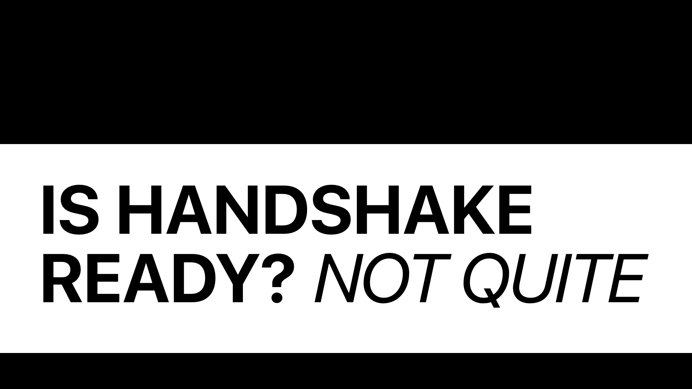

> [Handshake](https://handshake.org) is a promising blockchain-based alt-root of the DNS. This infosite outlines the 3 key areas Handshake needs to focus on before it's truly ready: availability, usability, and scalability.
